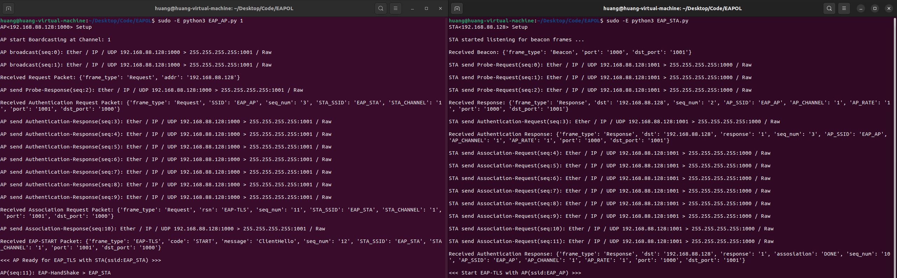

Simulation for Wifi pre-authentication frames transmission. (EAPOL)
* AP: sudo -E python3 EAP_AP.py <CHANNEL_NUMBER: 1>
* AP: sudo -E python3 EAP_STA.py

### Files:
    > * EAP_AP.py: AP 端實現，包括握手數據的生成和發送
    > * EAP_STA.py: STA 端實現，包括握手數據的接收和處理

### Process:

* 關聯 (Association)

    * 探測請求 (Probe Request)：
        STA 發送探測請求，請求周圍 AP 的可用性

    * 探測回應 (Probe Response)：
        AP 收到探測請求後，回應其可用性

    * 認證請求 (Authentication Request)：
        STA 向 AP 發送認證請求

    * 認證回應 (Authentication Response)：
        AP 收到認證請求後，回應 STA，確認認證成功

    * 關聯請求 (Association Request)：
        STA 向 AP 發送關聯請求，請求建立連接

    * 關聯回應 (Association Response)：
        AP 收到關聯請求後，回應 STA，確認關聯成功

* 握手數據 (Handshake Data)

    * AP 端的握手數據 (EAP_TLS)：
        * AP 生成臨時的 ECDHE 密鑰對，並生成 BLS 密鑰對以進行簽名
        * AP 使用 BLS 簽署 ECDHE 公鑰，並合併公鑰和簽名
        * AP 使用 ECDHE 生成的共享密鑰派生 AES 密鑰，並加密數據
        * AP 發送包含初始化向量（IV）、加密數據、公鑰和 BLS 公鑰的握手數據包

    * STA 端的握手數據 (EAP_TLS)：
        * STA 接收 AP 的握手數據包，並提取初始化向量（IV）、加密數據、公鑰和 BLS 公鑰
        * STA 生成自己的 ECDHE 密鑰對，並與 AP 的公鑰計算共享密鑰
        * STA 使用共享密鑰派生 AES 密鑰，並解密數據
        * STA 驗證 AP 的簽名
        * STA 生成並簽署自己的 ECDHE 公鑰，並加密數據
        * STA 發送包含初始化向量（IV）、加密數據和簽名公鑰的握手回應數據包

### Output:

### Issue:
Received HandShake Data: {'frame_type: EAP-TLS', 'dst: 192.168.88.128', 'code: HandShake', 'message: ServerHello', 'tls_data: c8a9299cf4c66cc3d77010f2558ea36d0a317b4872dc81e2ab16f9da699fb24ea7db3c9821461647595868fc84391e4441e7bee998fd66a0c8627c93c5d813ac2a9aa044f4738b4c9677bf89427340a02e059560e25baffaaa5fccba1c121c32a16b84af8aaeb22175ffd1dfe8b6e9b304375859cf3930d16e5646e80069e1880986763fc53ff27b38f9b197bb6e32a8e2a6ea79f4c548fa6b2777d6bd20932aae1f09143504edc71c7c4437a55668b1597fef4ac7d6feb939057ef4823b508131741b51717d20565306fa3f8b5d84f56fcac21cec4628f4bd958b87f0834561', 'iv: a4fcff4d64e20daf95ab96c42c372fde', 'pbk: 9502f8d9425a08104b386e34c0e5ea144f3f5d66bf7d2f7b4b9960e3fc250254de80de52e673ea62d796b2d80208828e'}

*** Error STA Processing HandShake Packet: Unsupported elliptic curve point type
Traceback (most recent call last): ...
ec.EllipticCurvePublicKey.from_encoded_point()
ValueError: Unsupported elliptic curve point type